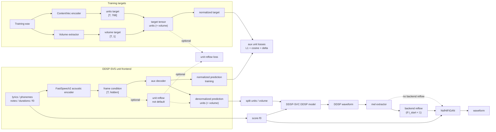

# DDSP-SVS

DDSP-SVS is an experimental singing voice synthesis project based on
[DiffSinger(openvpi)](https://github.com/openvpi/DiffSinger). It trains a DiffSinger-like
frontend to predict ContentVec units instead of mel spectrograms, then renders
audio with a DDSP-SVC backend.



The goal is to keep the text-to-singing frontend close to DiffSinger while
reusing DDSP-SVC models as the acoustic backend.

The main code path is:

- `preprocessing/unit_binarizer.py` extracts ContentVec units and volume from
  training audio.
- `training/unit_acoustic_task.py` trains `DiffSingerAcoustic` to predict
  `units` plus optional `volume`.
- `modules/toplevel.py` keeps the DiffSinger acoustic encoder and uses the aux
  decoder as the default unit frontend output.
- `modules/ddsp_svc_backend.py` splits predicted units and volume, then calls
  the bundled DDSP-SVC backend renderer.

## Status

This repository is still experimental. The currently recommended path is:

- train the auxiliary-decoder unit frontend;
- keep DDSP-SVC as a frozen backend;
- use one-step `scripts/infer.py acoustic` inference for rendering.

Shallow diffusion on units and extra variance controls are kept in the codebase,
but they are not the default path.

## Setup

Install PyTorch and torchaudio for your CUDA version first, then install the
Python dependencies:

```bash
python -m pip install pip==24.0
pip install -r requirements.txt
```

`fairseq==0.12.2` is used for legacy ContentVec checkpoints and is known to
require `pip==24.0` during installation.

Prepare these assets:

<details>
<summary>Required model assets</summary>

```text
checkpoints/contentvec/checkpoint_best_legacy_500.pt
checkpoints/nsf_hifigan/config.json
checkpoints/nsf_hifigan/model.ckpt
```

For DDSP-SVC backend inference, the backend checkpoint should be paired with its
`config.yaml` in the same directory:

```text
ddspmodel/
  config.yaml
  model_*.pt
```

The DDSP-SVC inference runtime is bundled in this repository under
`backend/ddsp`. You do not need a full DDSP-SVC checkout for normal inference.
The `--ddsp-svc` option is kept as an optional asset root for compatibility.

</details>

## Training

Start from the acoustic template and edit dataset paths, dictionaries,
validation items, and ContentVec checkpoint path:

```bash
cp configs/templates/config_acoustic.yaml configs/my_acoustic.yaml
```

Binarize the dataset:

```bash
python scripts/binarize.py --config configs/my_acoustic.yaml
```

Train the unit frontend:

```bash
python scripts/train.py \
  --config configs/my_acoustic.yaml \
  --exp_name my_unit_frontend \
  --reset
```

Checkpoints are saved to:

```text
checkpoints/my_unit_frontend/
```

## Inference

Run the DDSP-SVS frontend and DDSP-SVC backend in one command:

```bash
python scripts/infer.py acoustic samples/example.ds \
  --exp my_unit_frontend \
  --model checkpoints/ddspmodel/model_1600.pt \
  --out outputs/example.wav \
  --spk-id 1 \
  --infer-step 50
```

<details>
<summary>Additional inference options</summary>

If your NsfHifiGAN checkpoint is not at `checkpoints/nsf_hifigan/model.ckpt`,
pass it explicitly:

```bash
python scripts/infer.py acoustic samples/example.ds \
  --exp my_unit_frontend \
  --model checkpoints/ddspmodel/model_1600.pt \
  --vocoder-ckpt /path/to/nsf_hifigan/model.ckpt \
  --out outputs/example.wav
```

To save the intermediate unit payload:

```bash
python scripts/infer.py acoustic samples/example.ds \
  --exp my_unit_frontend \
  --model checkpoints/ddspmodel/model_1600.pt \
  --out outputs/example.wav \
  --save-units
```

This writes a `.units.pt` file next to the output wav unless `--units-out` is
specified.

</details>

<details>
<summary>ONNX export</summary>

**ONNX export**

Export the DDSP-SVS unit frontend with the regular DiffSinger acoustic exporter:

```bash
python scripts/export.py acoustic --exp my_unit_frontend
```

Export a DDSP-SVC backend checkpoint to ONNX:

```bash
python scripts/export_ddsp_backend_onnx.py \
  -m checkpoints/ddspmodel/model_1600.pt \
  -o checkpoints/ddspmodel/onnx \
  --skip-check
```

The backend export writes:

```text
encoder.onnx
velocity.onnx
svc.json
```

Remove `--skip-check` to run a small ONNXRuntime smoke check after export.

</details>

<details>
<summary>Debug tools</summary>

**Debug tools**

Debug scripts are kept under `scripts/debug/`.

Render a saved unit payload:

```bash
python scripts/debug/vocode_units.py outputs/example.units.pt \
  --model checkpoints/ddspmodel/model_1600.pt \
  --out outputs/example.wav \
  --spk-id 1 \
  --infer-step 50
```

Compare predicted units against binary ground truth:

```bash
python scripts/debug/analyze_units.py \
  --pred outputs/example.units.pt \
  --binary-data-dir data/ddsp_svs/binary \
  --prefix valid \
  --name ITEM_NAME
```

</details>

## License

This repository is a fork of [openvpi/DiffSinger](https://github.com/openvpi/DiffSinger) and keeps its Apache 2.0 license.
license. The bundled DDSP-SVC backend code and any pretrained checkpoints keep
their original license and model usage terms.
